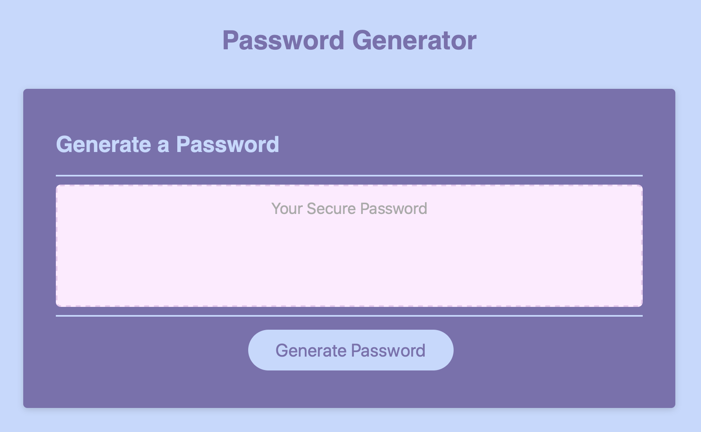
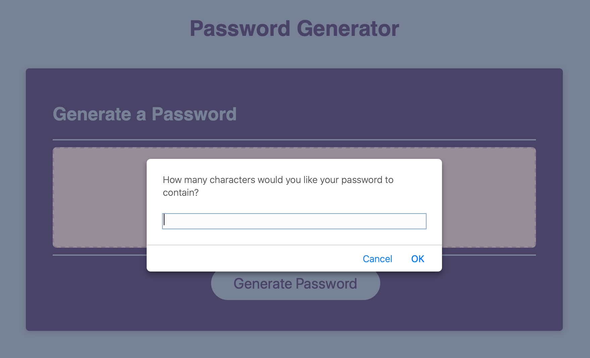
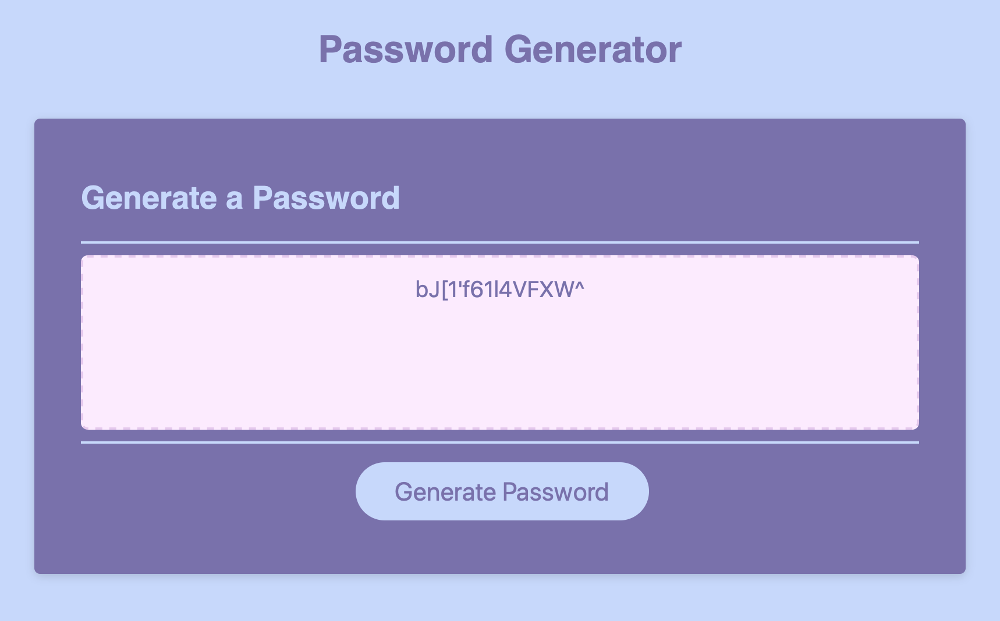

# Password Generator

For this assignment I used JavaScript, HTML, and CSS. This was my first time using JavaScript!

To use this app, click the 'Generate Password' button towards the bottom of the screen, follow the prompts, and then copy your unique password!

<h3>Images</h3>

live link: https://avatl.github.io/pwrd-generator-hw3/
